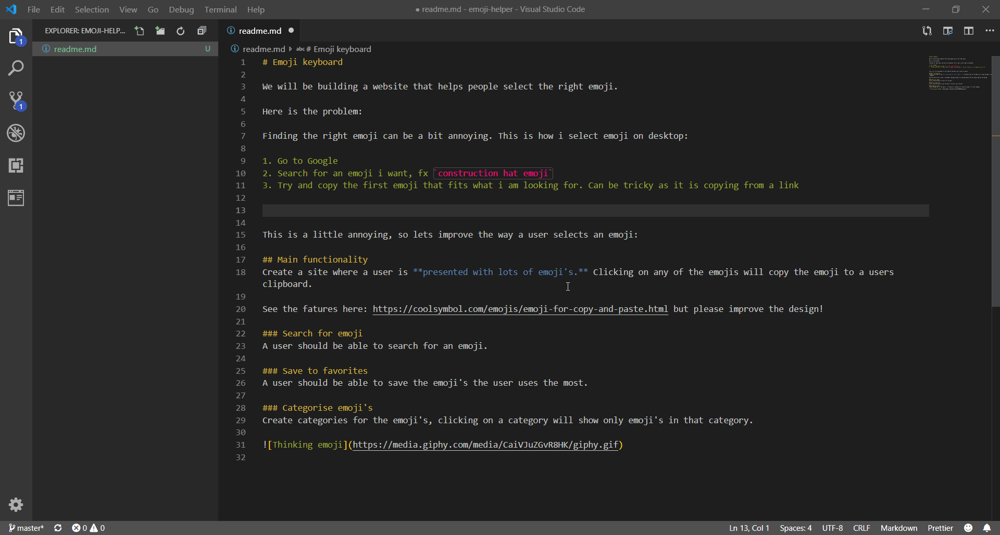
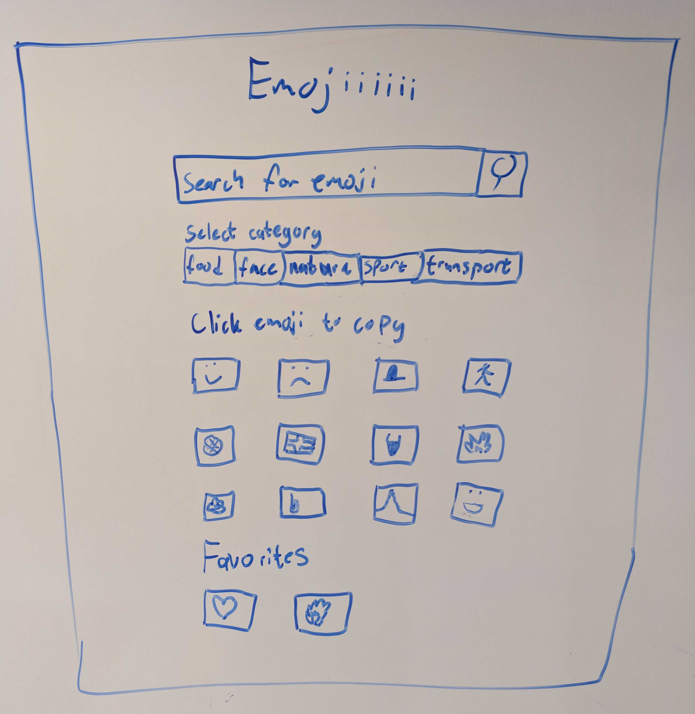

# Emoji keyboard

We will be building a website that helps people select the right emoji. Kind of like this: https://coolsymbol.com/emojis/emoji-for-copy-and-paste.html

## The problem

Finding the right emoji can be a bit annoying. This is how i select emoji on desktop:

1. Go to Google
2. Search for an emoji i want, fx `construction hat emoji` 👷
3. Try and copy the first emoji that fits what i am looking for



This is an annoying workflow, so lets improve the way a user selects an emoji:

## User stories

User stories are short descriptions of features, told from the perspective of a user.

They typically are structured as such:

> As a < type of user >, I want < some goal > so that < some reason >

### User story 1
As a user i want an overview of a lot of emoji's. 

### User story 2
As a user i want search for an emojii to find a specific emoji.

### User story 3
As a user i want to click on an emoji to copy it to my clipboard.

### User story 4
As a user i want to select a category of emoji's.

### User story 5
As a user i want to save an emoji to my favorites so i can quickly find them later.


## Implementation details

To get the data about the emoji's use this api: `https://raw.githubusercontent.com/amio/emoji.json/master/emoji.json`

If you start having problems with getting the emoji data from github, you can do two things:
1. Donwload the data locally and put the json into the main.json
2. Get a `client_id` and `client_secret` from github. This will allow for more calls to github. Follow this article: https://auth0.com/docs/connections/social/github For the webpage just put anything. The url will then be: `https://raw.githubusercontent.com/amio/emoji.json/master/emoji.json?client_id=YOUR_CLIENT_ID&client_secret=YOUR_CLIENT_SECRET`

You can use the `index.html`, `main.js` and `main.css` as a start for your project. 

p.s. If you are using Visual Studio Code, consider using [Live server](https://marketplace.visualstudio.com/items?itemName=ritwickdey.LiveServer). It will automatically update your css, js and html when you make a change!

### User story 1
1. Fetch the data
2. Render the emoji's

### User story 2
Add an `input` where users can search for an emoji. On every change in the input filter the emoji's.

### User story 3
Pretty selfexplanatory. There is a function available to you called `writeToClipboard`. It can be used like this:

```js
writeToClipboard('Text to copy');
```

It will return a promise so you can check if the copy was successful or failed.

### User story 4
Clicking on a category should filter the emoji's depending on the category i clicked. 

### User story 5 *optional*
It should be possible to add an emoji as favorite. On the site there should be a list of favorite emoji's. Use [local storage](https://blog.logrocket.com/the-complete-guide-to-using-localstorage-in-javascript-apps-ba44edb53a36/) for this feature. You must find a way to add an emoji to favorite. Hmm maybe this is actually not possible, see if you can find a solution to it, i could not.

## Mockup

Here is a mockup for the project


